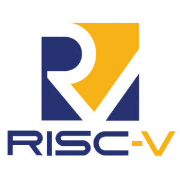

# redesigned-potato

[![Contributors][contributors-shield]][contributors-url]
[![Forks][forks-shield]][forks-url]
[![Stargazers][stars-shield]][stars-url]

# CSC 225 

All of my course files (labs and projects) for CSC 225 (Introduction to Computer Organization) taken through Cal Poly, with Professor 

### Installation

[contributors-shield]: https://img.shields.io/github/contributors/Kaweees/csc-225.svg?style=for-the-badge
[contributors-url]: https://github.com/Kaweees/csc-225/graphs/contributors
[forks-shield]: https://img.shields.io/github/forks/Kaweees/csc-225.svg?style=for-the-badge
[forks-url]: https://github.com/Kaweees/csc-225/network/members
[stars-shield]: https://img.shields.io/github/stars/Kaweees/csc-225.svg?style=for-the-badge
[stars-url]: https://github.com/Kaweees/csc-225/stargazers